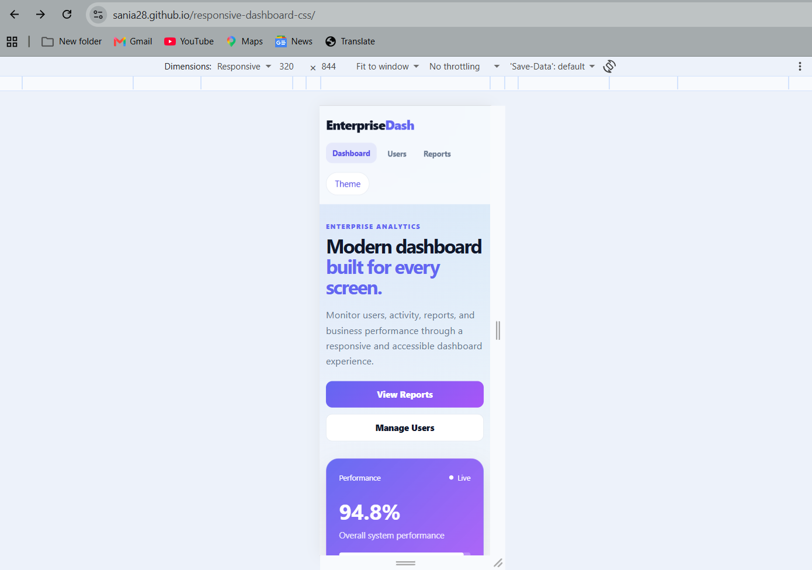
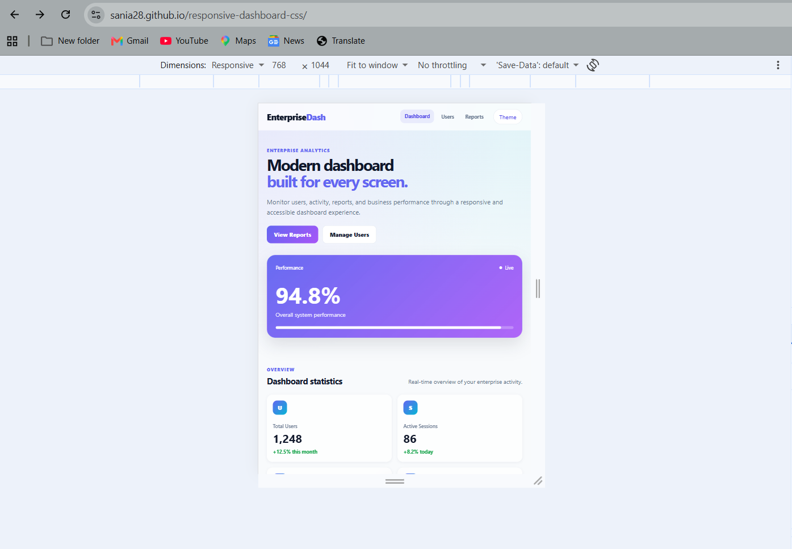
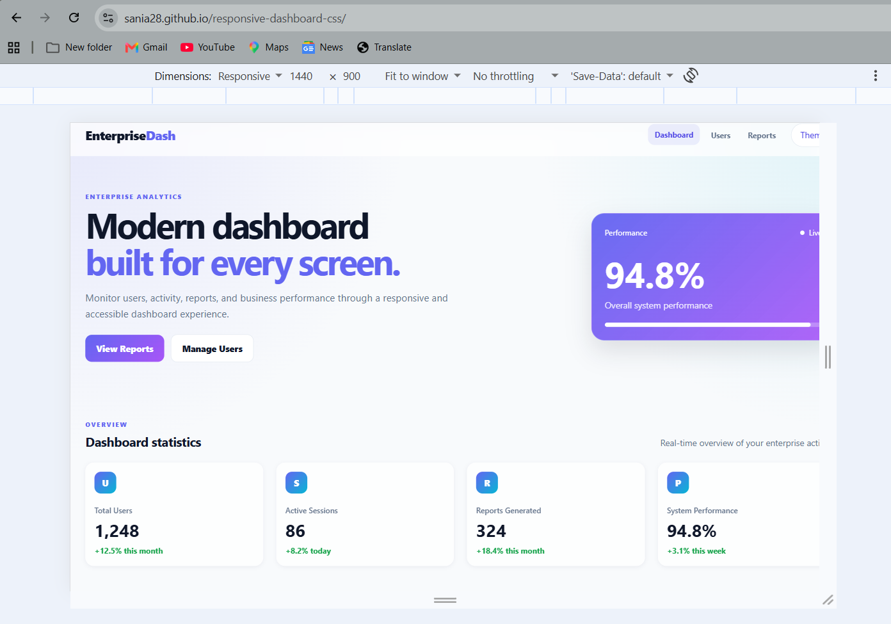

# Responsive Enterprise Dashboard

A modern, responsive enterprise dashboard built using **HTML5 and modern CSS architecture**. This project demonstrates design tokens, CSS Grid, Flexbox, responsive breakpoints, glassmorphism, shadows, transitions, and dark/light theme variables.

## 🚀 Project Overview

This project was developed as part of **RAB Tech Academy Task 04 – Responsive Design Tokens & Mobile-First CSS Architecture**.

The dashboard is designed with a mobile-first approach and adapts smoothly across mobile, tablet, laptop, and large desktop screens.

## ✨ Features

* Mobile-first responsive CSS architecture
* CSS custom properties / design tokens
* Responsive CSS Grid layouts
* Flexbox-based navigation and components
* Responsive dashboard statistics
* Responsive activity tables
* User management page
* Reports page
* Glassmorphism-inspired visual styling
* Soft shadows and rounded cards
* Hover and focus transitions
* Dark/light theme variables
* Accessible semantic HTML structure
* Responsive form controls
* Mobile horizontal overflow protection
* Reduced-motion accessibility support

## 🎨 Design Tokens

The stylesheet uses centralized CSS custom properties for consistent styling.

### Colors

* Primary brand color
* Secondary accent color
* Background and surface colors
* Text and muted text colors
* Success and warning colors
* Dark theme colors

### Typography

* Responsive font-size tokens
* System-based font stack
* Multiple heading and body text scales

### Spacing

Reusable spacing tokens are defined for consistent layouts:

* `--space-1`
* `--space-2`
* `--space-3`
* `--space-4`
* `--space-5`
* `--space-6`
* `--space-8`
* `--space-10`
* `--space-12`
* `--space-16`

### Border Radius & Shadows

The project includes reusable radius and shadow tokens for cards, buttons, panels, and other interface elements.

## 📱 Responsive Breakpoints

The layout follows a mobile-first strategy with fluid breakpoints:

| Breakpoint | Target                |
| ---------- | --------------------- |
| `320px`    | Small mobile devices  |
| `768px`    | Tablets               |
| `1024px`   | Laptops and desktops  |
| `1440px`   | Large desktop screens |

The dashboard uses responsive Grid and Flexbox layouts to reorganize content according to available screen width.

## 🗂️ Project Structure

```text
responsive-dashboard-css/
│
├── css/
│   └── styles.css
│
├── pages/
│   ├── dashboard.html
│   ├── users.html
│   └── reports.html
│
├── screenshots/
│   ├── mobile.png
│   ├── tablet.png
│   └── desktop.png
│
├── index.html
└── README.md
```

## 📊 Dashboard Pages

### Dashboard

Provides:

* Performance overview
* Statistics cards
* Recent activity
* Quick actions

### Users

Provides:

* User creation form
* User information
* Responsive user table

### Reports

Provides:

* Report overview cards
* Report status information
* Responsive report table

## 📸 Responsive Demo Screenshots

### Mobile – 320px



### Tablet – 768px



### Desktop – 1440px



## 🛠️ Technologies Used

* HTML5
* CSS3
* CSS Custom Properties
* CSS Grid
* Flexbox
* Responsive Web Design
* Glassmorphism
* Accessibility-focused styling

## ▶️ How to Use

1. Clone or download the repository.
2. Open `index.html` in a modern web browser.
3. Navigate between Dashboard, Users, and Reports.
4. Test the interface using different viewport sizes.

## 📌 Task Requirements Covered

* [x] Design token palette
* [x] Typography scale
* [x] Spacing tokens
* [x] Border radius tokens
* [x] Responsive Grid
* [x] Flexbox
* [x] Mobile-first CSS
* [x] 320px breakpoint
* [x] 768px breakpoint
* [x] 1024px breakpoint
* [x] 1440px breakpoint
* [x] Glassmorphism styling
* [x] Soft shadows
* [x] Hover transitions
* [x] Dark/light theme variables
* [x] Mobile horizontal overflow protection
* [x] Responsive demo screenshots

## 👩‍💻 Author

**Sania Mujtaba**

B.Tech Computer Science & Engineering

GitHub: [sania28](https://github.com/sania28)
